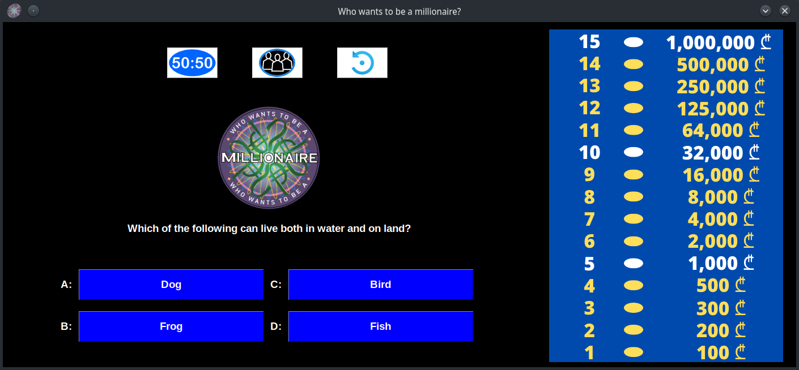

# WHO WANTS TO BE A MILLIONAIRE

 The game is created in python using tkinter. 

## Rules

 After 5 correct answer - 1,000 GEL guaranteed win. 

 After 10 correct answer - 32,000 GEL guaranteed win. 

 After 15 correct answer - 1,000,000 GEL guaranteed win.

# ------------------------------------------------
## BUTTONS
### Help buttons can be used only once
# ------------------------------------------------

 1) 50:50 - Leaves only 2 answers.

 2) Audience - Returns chart with audience percentage results.

 3) Restart - Restarts the game at any stage.

# ------------------------------------------------

# GUI IMAGE
</img>